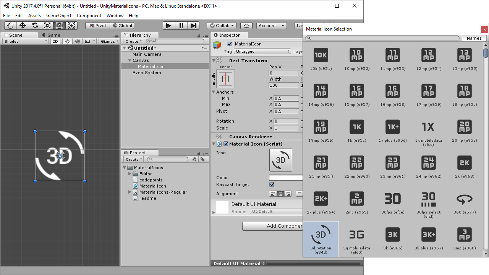

# Unity Material Icons

This project simplifies the usage of Google's Material Design icons on Unity.

Developed on Unity 2017, but should be compatible with all versions.

## Credits

This project was created by Conrado (https://github.com/convalise).

It makes usage of the [Material Design icons project by Google](https://github.com/google/material-design-icons).\
More information on the Google's project can be found at the [Material Icons Guide](http://google.github.io/material-design-icons/).

## License

This software is licensed under **Apache License 2.0**. You can find the full text of the license [here](LICENSE).